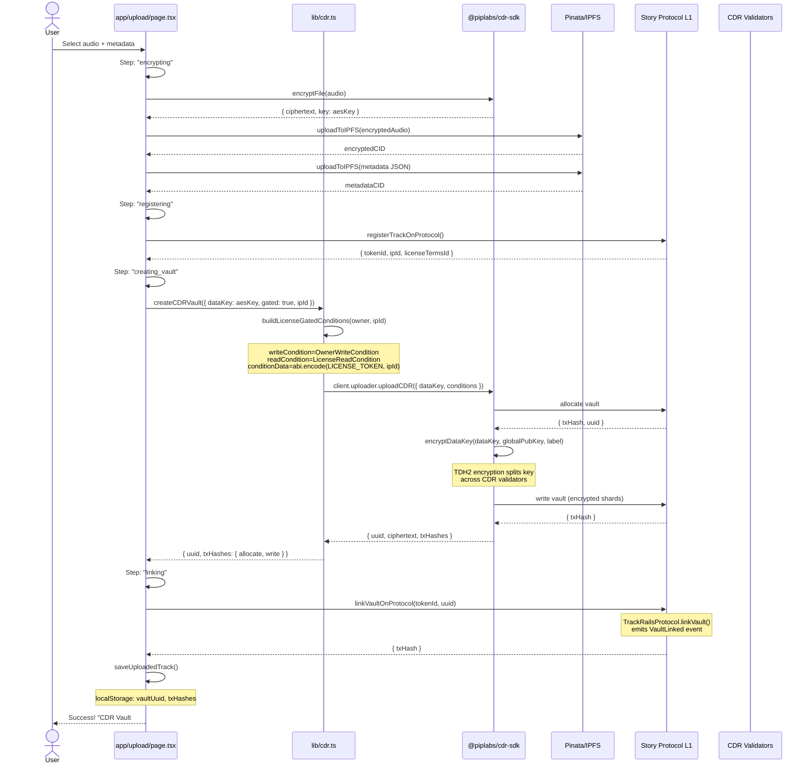
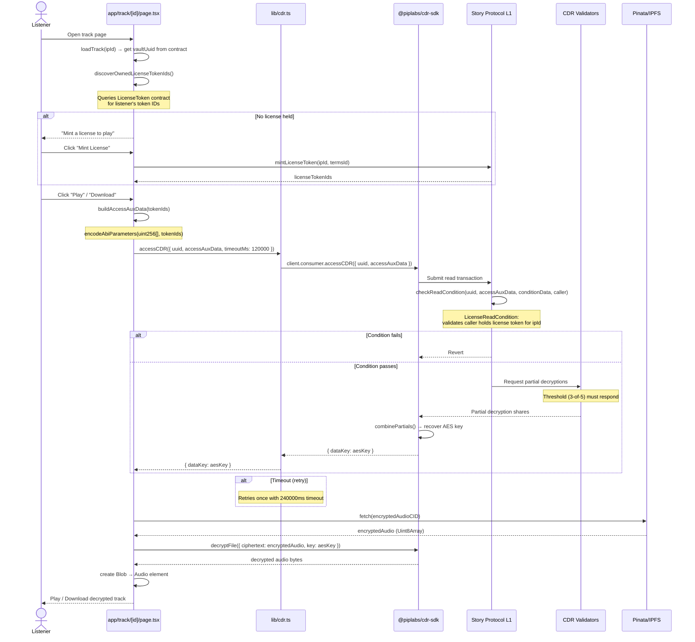
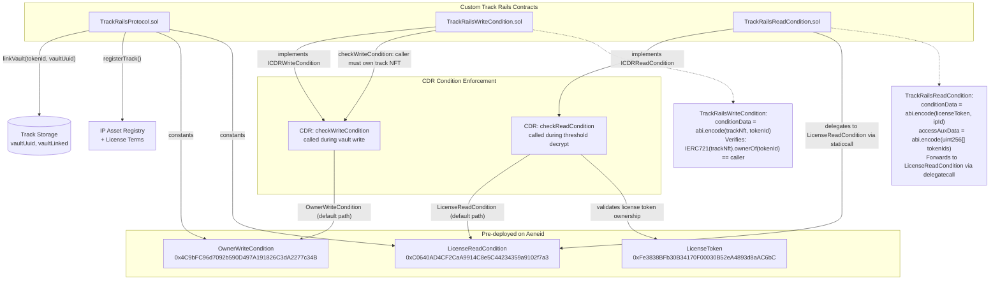
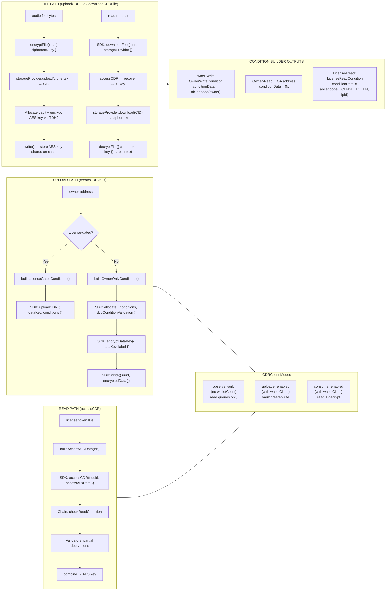
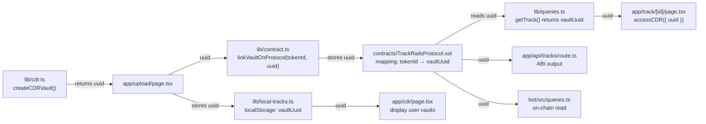
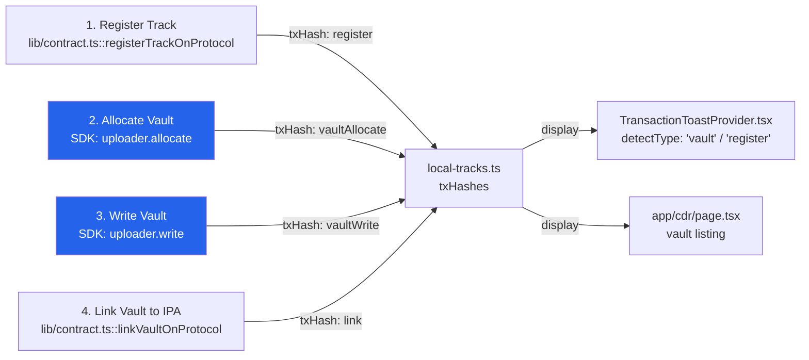

# CDR Architecture — Track Rails

## 1. System Overview: All CDR Touchpoints

```mermaid
graph TB
    subgraph Client["Browser Client"]
        direction TB
        WP[WasmProvider<br/>initWasm] --> HK[useCDRClient Hook<br/>createCDRClient]
        UP[Upload Page<br/>page.tsx] --> HK
        TP[Track Detail Page<br/>page.tsx] --> HK
        CP[CDR Info Page<br/>page.tsx]
        NLP[Navbar / Footer]
    end

    subgraph CDR_Lib["lib/cdr.ts — Core CDR Library"]
        direction TB
        CF[createCDRClient<br/>new CDRClient()]
        BO[buildOwnerOnlyConditions<br/>OwnerWriteCondition + EOA read]
        BL[buildLicenseGatedConditions<br/>OwnerWriteCondition + LicenseReadCondition]
        AV[allocateVault<br/>client.uploader.allocate]
        CV[createCDRVault<br/>inline ≤1024 bytes]
        UF[uploadCDRFile<br/>file upload path]
        AC[accessCDR<br/>client.consumer.accessCDR]
        DF[downloadCDRFile<br/>client.consumer.downloadFile]
        AE[aesEncrypt / aesDecrypt<br/>encryptFile / decryptFile]
        BAA[buildAccessAuxData<br/>encode uint256[] token IDs]
        CC[CDR_CONTRACTS constants<br/>OwnerWriteCondition, LicenseReadCondition, LicenseToken]
    end

    subgraph Hooks["hooks/use-cdr.ts"]
        UC[useCDRClient<br/>returns { client, isConnected, address }]
    end

    subgraph SDK["@piplabs/cdr-sdk (v0.2.1)"]
        CDR[CDRClient]
        IW[initWasm]
        EF[encryptFile]
        DF_SDK[decryptFile]
        UTL[uuidToLabel]
    end

    subgraph Story_Chain["Story Protocol L1 — Aeneid Testnet"]
        OWC[OwnerWriteCondition<br/>0x4C9b...34B]
        LRC[LicenseReadCondition<br/>0xC064...7a3]
        LT[LicenseToken<br/>0xFe38...6bC]
        TRP[TrackRailsProtocol.sol<br/>linkVault()]
        TW[TrackRailsWriteCondition.sol<br/>checkWriteCondition]
        TR[TrackRailsReadCondition.sol<br/>checkReadCondition]
    end

    subgraph IPFS["IPFS / Pinata"]
        EC[(Encrypted Audio)]
        MD[(Track Metadata)]
    end

    subgraph Storage["Local Storage"]
        LTS[local-tracks.ts<br/>vaultUuid, vaultLinked, txHashes]
        LLS[license-tokens.ts<br/>token IDs per IP Asset]
    end

    subgraph API["Next.js API Routes"]
        SP[api/story-proxy/[...path]<br/>REST proxy for CDR DKG queries]
        TR[api/tracks<br/>vaultUuid + vaultLinked from contract]
    end

    subgraph Bot["Telegram Bot (bot/)"]
        BQ[bot/src/queries.ts<br/>reads vaultUuid, vaultLinked]
        BH[bot/src/handlers/help.ts<br/>"CDR threshold encryption"]
    end

    %% Connections
    IW --> WP
    WP --> UC
    CF -.-> CDR
    CF --> API
    UC --> CV
    UC --> AC
    UP --> CV
    UP --> EF
    TP --> AC
    TP --> BAA
    TP --> AE
    CV --> AV
    BO --> AV
    BL --> AV
    CV --> UTL
    CV --> CDR
    AC --> CDR

    CDR -->|observer.getGlobalPubKey| Story_Chain
    CDR -->|uploader.allocate| Story_Chain
    CDR -->|uploader.encryptDataKey| Story_Chain
    CDR -->|uploader.write| Story_Chain
    CDR -->|consumer.accessCDR| Story_Chain

    CV -->|license-gated path: uploadCDR| CDR
    CV -->|owner-only path: allocate→encrypt→write| CDR
    UF -->|license-gated path: uploadFile| CDR
    UF -->|owner-only path: encrypt→storage→allocate| CDR
    UF --> IPFS

    UP --> EC
    UP --> MD
    UP --> LTS
    TP --> EC
    TP --> LLS
    TP --> LTS

    TRP -->|stores vaultUuid| TL[(Track Storage)]
    LTS --> TL

    style WP fill:#9333ea,color:#fff
    style CDR_Lib fill:#2563eb,color:#fff
    style Hooks fill:#7c3aed,color:#fff
    style SDK fill:#059669,color:#fff
    style Story_Chain fill:#d97706,color:#fff
    style IPFS fill:#0891b2,color:#fff
    style Storage fill:#4f46e5,color:#fff
    style Bot fill:#dc2626,color:#fff
```

## 2. Upload Flow — AES-256 + CDR Vault Creation



## 3. Playback/Decryption Flow — Threshold Decryption



## 4. Smart Contract Layer — CDR Condition Contracts



## 5. Detailed Data Flow — Every CDR API Call



## 6. Complete CDR API Surface Usage Map

```mermaid
mindmap
  root((CDR SDK v0.2.1<br/>Usage Map))
    initWasm
      WasmProvider.tsx
    CDRClient
      lib/cdr.ts::createCDRClient
      hooks/use-cdr.ts
    uploader
      allocate
        lib/cdr.ts::allocateVault
        lib/cdr.ts::createCDRVault (owner-only path)
        lib/cdr.ts::uploadCDRFile (owner-only path)
      encryptDataKey
        lib/cdr.ts::createCDRVault (owner-only path)
        lib/cdr.ts::uploadCDRFile (owner-only path)
      write
        lib/cdr.ts::createCDRVault (owner-only path)
        lib/cdr.ts::uploadCDRFile (owner-only path)
      uploadCDR
        lib/cdr.ts::createCDRVault (license-gated path)
      uploadFile
        lib/cdr.ts::uploadCDRFile (license-gated path)
    consumer
      accessCDR
        lib/cdr.ts::accessCDR
        app/track/[id]/page.tsx
      downloadFile
        lib/cdr.ts::downloadCDRFile
    encryptFile
      lib/cdr.ts::aesEncrypt
      app/upload/page.tsx (direct import)
    decryptFile
      lib/cdr.ts::aesDecrypt
    uuidToLabel
      lib/cdr.ts (createCDRVault, uploadCDRFile)
    Contract Addresses
      OWNER_WRITE_CONDITION
        lib/cdr.ts constant
        TrackRailsProtocol.sol constant
      LICENSE_READ_CONDITION
        lib/cdr.ts constant
        TrackRailsProtocol.sol constant
      LICENSE_TOKEN
        lib/cdr.ts constant
        license-tokens.ts import
    Story API Proxy
      api/story-proxy/[...path]
        Used as CDRClient apiUrl
    Condition Encoders
      buildOwnerOnlyConditions
        OwnerWriteCondition + EOA read + skipConditionValidation
      buildLicenseGatedConditions
        OwnerWriteCondition + LicenseReadCondition
      buildAccessAuxData
        Encodes uint256[] license token IDs
```

## 7. Cross-Cutting Concern: Vault UUID Flow



## 8. Transaction Flow — Hashes Tracked per Upload


